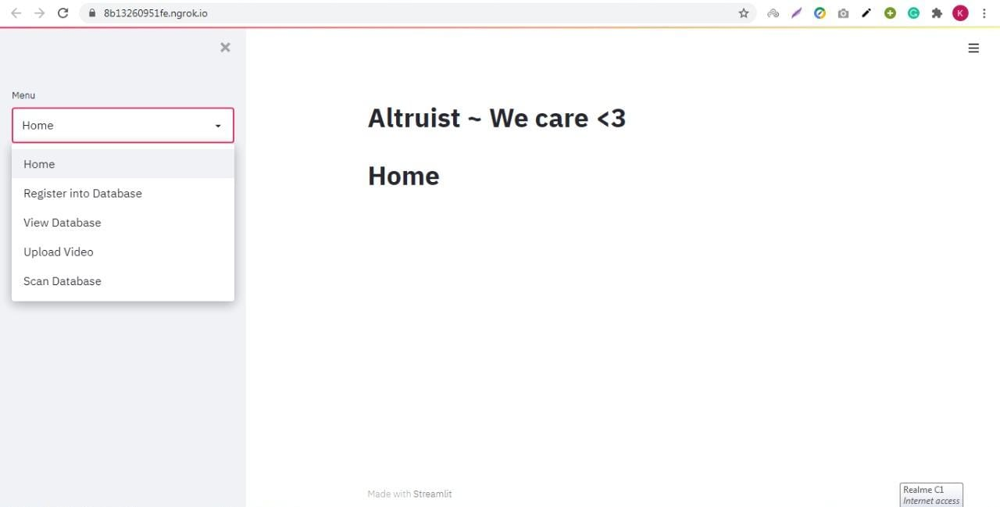
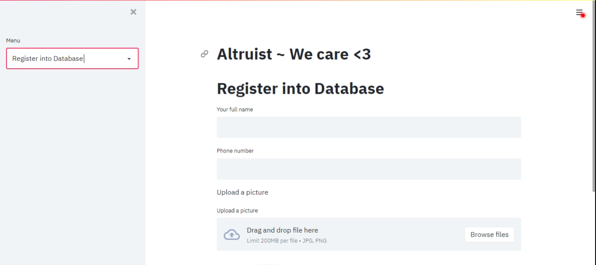
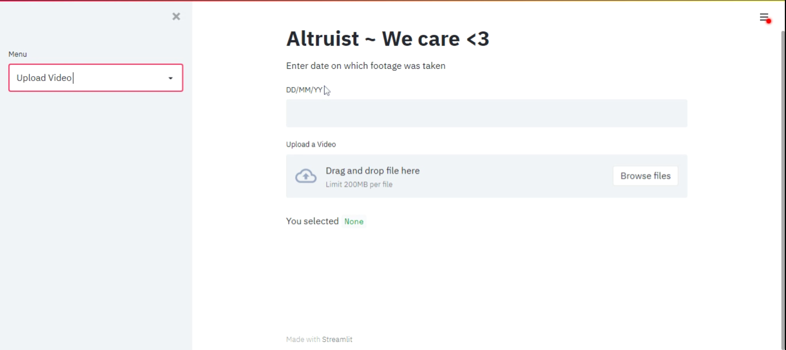
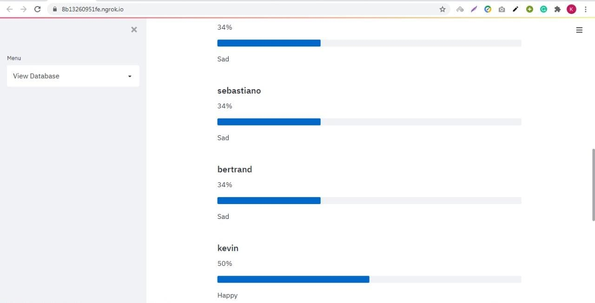

# Altruist
## Team Name: Kryptonites

<p align="center">
</p>

<a href="https://hack36.com">  </a>


## Introduction:

  - Often we hear college students suffering from depression and taking harsh actions due to academic pressure, peer pressure etc.</br>
  - Our project keeps track of all hostellers over a period of time using CCTV entrance footage and performs specific actions if it falls below a certain threshold.</br>
  - Altruist uses 2 models, one of which is to recognise the person in the frame and the other to assign the happiness score</br>
  


## Installation:

Git cloning the repository
```
git clone https://github.com/kunal2812/Altruist-Hack36.git
```
Installing all dependencies in requirements.txt
```
pip install -r requirements.txt
```
Change directory 
```
cd Altruist-Hack36
```
Run the application
```
streamlit run app.py
```
  
## Presentation Link:
  <a href="https://docs.google.com/presentation/d/1sxFQWPwb0HDdIfnU1kK6ChjPUvYjfy_D8F-5p0eJ6tQ/edit?usp=sharing">Link for Presentation </a>
  
## Video Link:
  <a href="https://drive.google.com/file/d/1UtW7bbZFRH2ixkF6Hitux6uA5YazGR6L/view?usp=sharing">Link for Video </a>
  


## Technology Stack:
  1) Tensorflow
  2) Streamlit
  3) Pandas
  4) Heroku
  
## Screenshots: 






## Contributors:

* [Kunal Katiyar](https://github.com/kunal2812)
* [Awanish Singh](https://github.com/ak-1-1)
* [Praveen Saraswat](https://github.com/SaraswatPraveen)


## License:

MIT

<a href="https://hack36.com">  </a>
